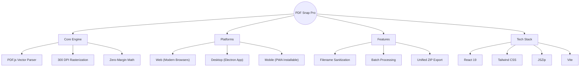
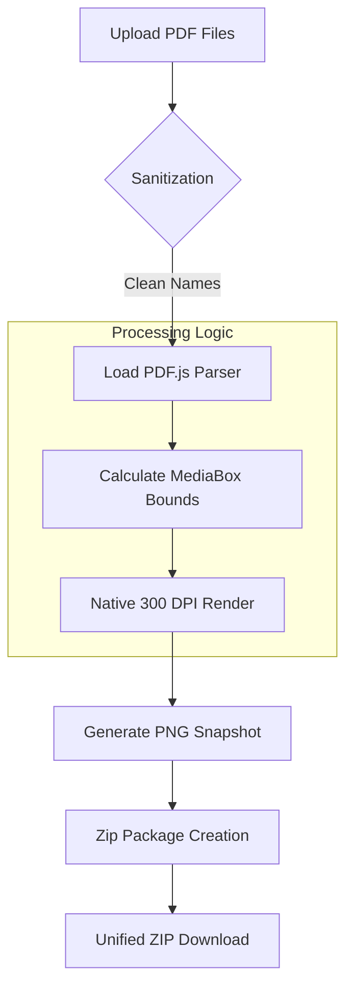
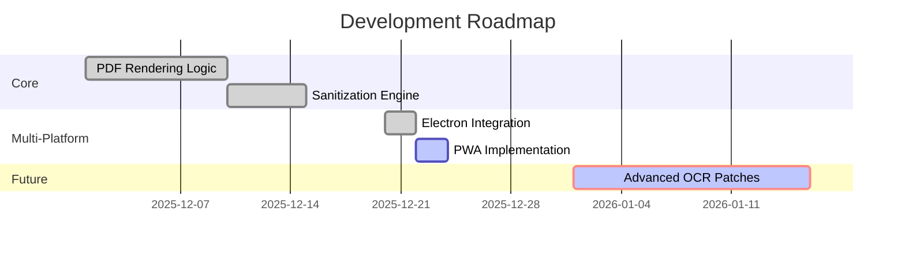

# 📸 PDF Snap Pro: Elite Serialization Engine

<p align="center">
  
</p>

<p align="center">
  
  
  
  
</p>

---

## ✨ Overview

**PDF Snap Pro** is a high-performance, deterministic document processing engine designed for architects, engineers, and developers who require **pixel-perfect accuracy**. Whether you're running it on a high-end desktop, a mobile device, or via a web browser, it delivers consistent, 300 DPI snapshots with zero margin artifacts.

### 🧠 Project Mind-Map



---

## ⚡ Technical Architecture

The following diagram illustrates the high-fidelity serialization pipeline.



---

## 🚀 Multi-Platform Launch Guide

### 📂 1. Desktop Application (Electron)
Experience the power of a native desktop shell with system-level optimization.

- **Developer Mode**:
  ```powershell
  npm run electron:dev
  ```
- **Build Portable App**:
  ```powershell
  npm run electron:build
  ```
> [!TIP]
> The desktop version supports larger file batches and provides a dedicated workspace environment.

### 📱 2. Mobile Experience (PWA)
Install PDF Snap Pro directly to your home screen with zero installation.

1. **Build the Assets**: `npm run build`
2. **Preview & Host**: `npm run preview`
3. **Install**: Open the link in Chrome (Android) or Safari (iOS) and select **"Add to Home Screen"**.

> [!IMPORTANT]
> The mobile version utilizes sophisticated service workers for offline processing and instant updates.

### 🌐 3. Web Deployment
Deploy to any static hosting (Vercel, Netlify, GitHub Pages).

```bash
npm run build
```

---

## 🛠 Features & Patches

| Feature | Description | Status |
| :--- | :--- | :--- |
| **Filename Sanitization** | Auto-strips special characters and spaces for OS safety. | ✅ Stable |
| **300 DPI Rendering** | High-fidelity snapshots at exact MediaBox dimensions. | ✅ Stable |
| **Batch ZIP Export** | Multi-file packaging with organized folder structure. | ✅ Stable |
| **Cross-Platform UI** | Responsive dark-mode interface powered by Tailwind. | ✅ Stable |
| **Offline Support** | Fully functional processing without internet connection. | 🛡️ Patch 1.2 |

---

## 💻 Development Workflow

To contribute or extend the engine:

1. **Clone & Install**:
   ```bash
   npm install
   ```
2. **Run Linting**:
   ```bash
   npm run lint
   ```
3. **Start Dev Server**:
   ```bash
   npm run dev
   ```



---

<p align="center">
  <i>Built with precision by the PDF Snap Pro Team.</i>
</p>
